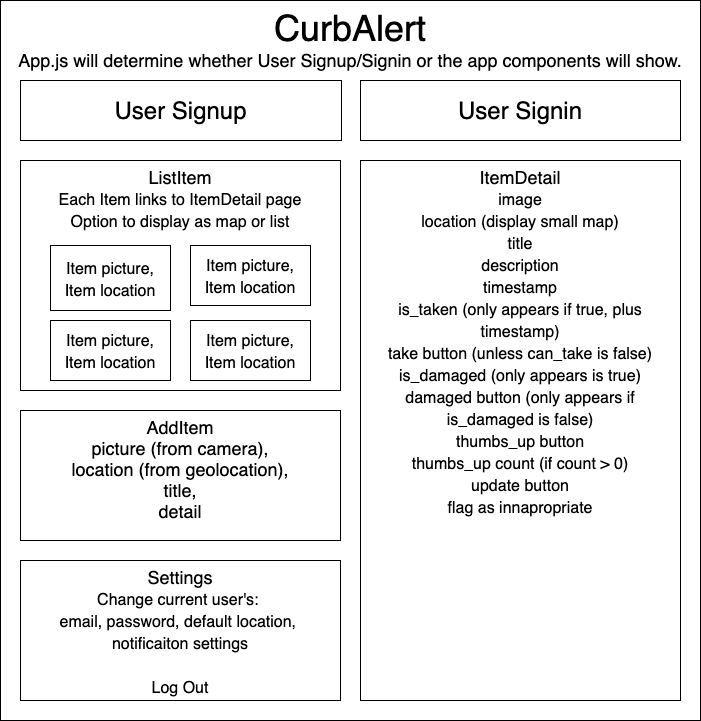

# **_Curb Alert_**

## **Work In Progress: 2/15/22 through 3/10/22**

### _Capstone Project for Epicodus Bootcamp_

#### Created By: **Christopher Neal**

## Technologies Used

- _Javascript_
- _React Native_
- _npm_
- _PropTypes_
- _UUID_
- _Babel_
- _React Native Vector Icons_

## Description

_This project was created as an independent Capstone project for Epicodus bootcamp. It shows proficiency in React Native._
_Curb Alert: Connecting Trash with Folks to whom it's Treasure. A user can upload an image of discarded furniture for others to see. A user can find discarded furniture near their location._

## Project Component Diagram

Components:

- Header

  - logo (link to ItemMap)
  - Settings link button (ideally opens camera, then uses image in form)
  - NewItem link button

- Settings

  - email
  - password
  - update email/password
  - default location
  - notification settings?
  - signout

- AddItem (appears after taking a picture?)

  - picture (should be automatic)
  - location (should be automatic)
  - title
  - detail

- ItemDetail

  - image
  - map
  - title
  - description
  - timestamp
  - is_taken (only appears if true, plus timestamp)
  - take button (unless can_take is false)
  - is_damaged (only appears if true)
  - damaged button
  - thumbs_up button
  - thumbs_up count (if count > 0)
  - update button
  - flag as innapropriate

- ItemMap
  - image
  - location

## Database Schema

users:

- email (required)
- password (required)
- is_admin, boolean (default false)
- default_location, zipcode (for push notifications)
- current_location, coordinates? (ideally from GPS, or entered zipcode, required)
- is_banned, boolean (default false, for users with malicious content)

items:

- posting user_id (allow multiple if )
- image, image file (required)
- location, coordinates? (pull from image or current location?, required)
- title, string (limit 50 chars)
- description, string (limit 140 chars)
- timestamp (listing should dissapear 1 week after being posted unless taken before)
- display, boolean (would this be the best way to determine whether to display an item?)
- is_taken, boolean
- is_damaged, boolean
- thumbs_up, integer (for users to confirm item is still there and in good condition)
- taken_time, timestamp (listing should dissapear 2 hours after being taken)
- can_take, boolean (default true, false for fruit trees or tiny libraries, extends listing lifetime?)
- flagged, boolean (default false, flag as innapropriate, plus immediatly remove for review)

## Setup/Installation Requirements

- _React version 3.2.0_
- _React version 17.0.2_
- _React-Native version 0.67.2_
- _Xcode_
- _Watchman_
- _Android Studio_
  (For detailed information on environment setup, see [React Native's Documentation](https://reactnative.dev/docs/environment-setup))

### Basic Setup

- Clone the GitHub repository: [https://github.com/christophermneal/curb-alert](https://github.com/christophermneal/curb-alert)
- From the main project directory, run `npm install` in the terminal to load necessary plugins and packages.
<!-- - Run `npm install --save-exact react-scripts@3.2.0` to install React version 3.2.0
- Run `npm run start` to start the application. -->

## Known Bugs

_None as of 2/19/22 10:14AM_

### License

_[MIT](https://opensource.org/licenses/MIT)_
Copyright (c) _2022_ _Christopher Neal_

### Support and Contact Details

- _[christopher.m.neal@gmail.com](mailto:christopher.m.neal@gmail.com)_

## Research & Planning Log

### Tuesday, 02/15

- **7:56PM - 8:42PM** Begin watching [Traversy Media React Native Crash Course Video](https://www.youtube.com/watch?v=Hf4MJH0jDb4&t=709s)
- **8:42PM - 10:00PM** Begin setting up environment using [React Native Docs](https://reactnative.dev/docs/environment-setup)
- **10:00PM - 10:22PM** Create README

### Friday, 02/17

- **8:00AM - 9:10AM** Finish setting up dev environment and walk through [Traversy Media React Native Crash Course Video](https://www.youtube.com/watch?v=Hf4MJH0jDb4&t=709s) to set up "Hello World" view

- **10:22AM - 11:32AM** Continue working through [Traversy Media React Native Crash Course Video](https://www.youtube.com/watch?v=Hf4MJH0jDb4&t=709s) to set up state and delete functionality. Got to 40:18 on video.

- **11:32AM - 12:43PM** Troubleshooting importing UUIDV4 and ReactNativeVectorIcons. Tried: update Ruby version to 3.0.3, reinstalling CocoaPods, running `pod install` from `CurbAlert/ios` Still not working but making progress.

- **12:43PM - 1:41PM** ReactNativeVectorIcons and UUIDV4 still not working. Still troubleshooting. Tried rebuilding project using Expo Cli Quickstart to no avail. Now researching linking libraries in [React Documentation](https://reactnative.dev/docs/linking-libraries-ios)

- **1:41PM - 3:14PM** Still not working and I'm out of ideas. Setting up Andriod dev environment (following the [React Documentation's guide](https://reactnative.dev/docs/environment-setup)) to see if packages will work there.

  - _Note: installation taking a while, reading through the rest of the React Documentation while I wait._

  - Build still fails on Android. Going to try something different.

- **4:32PM - 4:41PM** Adding Capstone Proposal and creating GitHub Repo
- **4:41PM - 5:56PM** Researching the problem:

  - [React Native Docs](https://reactnative.dev/docs/environment-setup)
  - [CocoaPods Docs](https://guides.cocoapods.org/using/a-gemfile.html) - Tried Bundle Install - not sure whether it helped.
  - [React Native Vector Icons Docs](https://github.com/oblador/react-native-vector-icons/blob/master/README.md#installation) and [Vimniky Luo's post on Medium](https://medium.com/@vimniky/how-to-use-vector-icons-in-your-react-native-project-8212ac6a8f06) - Tried manually linking the modules but they are already linked.
  - GOT IT! [This StackOverflow Article](https://stackoverflow.com/questions/2718246/xcode-warning-multiple-build-commands-for-output-file) told me to look in the "Copy Bundle Resources" Build Phase in XCode. I deleted the `.ttf` files and it _magically_ works now!

- **5:56PM - 6:42PM** UUID still not working. Researching:

  - Attempting to install [React Native Get Random Values](https://github.com/LinusU/react-native-get-random-values#readme)
  - Works now! I think the import needed updating too.

- **6:42PM - 7:19PM** Finish [Traversy Media React Native Crash Course Video](https://www.youtube.com/watch?v=Hf4MJH0jDb4&t=709s) and implement some features.

### Tuesday, 02/22

- **9:32PM - 11:54PM** Planning database structure, component diagram, and app UI layout.

### Thursday, 02/24

- **5:39PM - 5:59PM** Finish component diagram
- **5:59PM - 6:19PM** Adding Header icons and styling using flexbox, reference: [React styling docs](https://reactnative.dev/docs/flexbox)
- **6:19PM - 6:41PM** Add component files with boilerplate code
- **9:44PM - 9:58PM** Organize project structure
- **9:58PM - 10:36 PM** Research React Navigation:
  - [YouTube: Navigation in React Native](https://www.youtube.com/watch?v=9K7JCQbOHVA)
  - [ReactNavigation.org documentation](https://reactnavigation.org/docs/getting-started/)

### Friday, 02/25

- ** 7:59AM - 8:57AM** Troubleshoot program not building on Android - not sure what's happening here.
- ** 8:57AM - 9:33AM** Organize components, WIP: add description field to AddItem form.
  - Research React Native forms [YouTube: React-Native tutorial # Handle Input](https://www.youtube.com/watch?v=pF8ae5j9Q3g&list=PL8p2I9GklV44z6euF3nqS0TlKbaGiFUGO&index=18)
- ** 10:34AM - #:##AM** Continue research:
  - [YouTube: React-Native tutorial # submit simple form](https://www.youtube.com/watch?v=FZDOxrQNMjs&list=PL8p2I9GklV44z6euF3nqS0TlKbaGiFUGO&index=19)
  - Add description to state
